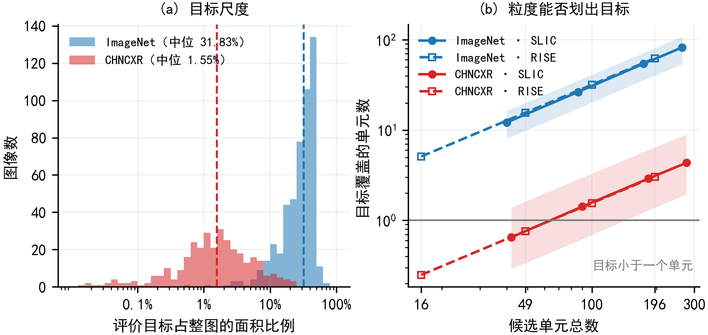
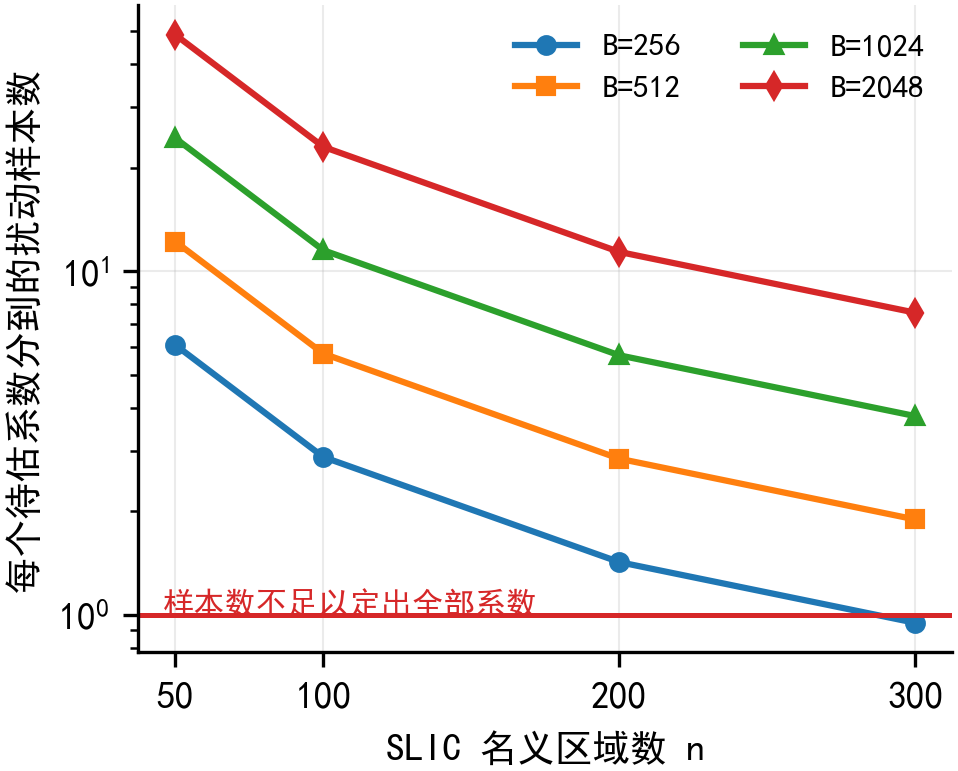
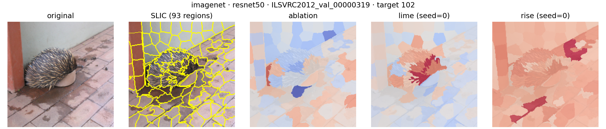
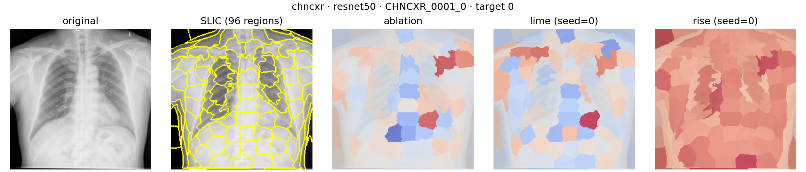

# M2 探索性数据分析（EDA）报告

| 项目项 | 内容 |
|---|---|
| 项目 | 扰动类与博弈论类图像归因方法比较 |
| 数据域 | ImageNet、CHNCXR |
| 模型 | ResNet-50、VGG13 |
| 运行环境 | Conda `cjy_mob` |
| 报告日期 | 2026-09-12 |

## 1. 分析目标

本报告完成 M2 阶段的数据探索、筛选后复核、预处理固化和特征表示设计，回答以下问题：

1. 两个数据域的样本、类别、图像尺寸、通道和定位标注是否完整；
2. ResNet-50 与 VGG13 共同分类正确筛选如何改变样本与类别分布；
3. 筛选前后目标区域尺度和实际 SLIC 区域数是否发生变化；
4. 哪组预处理、区域表示和扰动参数适合后续统一实验；
5. 数据与配置能否支持两个数据域、两种模型的端到端归因流程。

分析单位为图像。ImageNet 的定位目标为边界框栅格化区域，CHNCXR 的定位目标为逐图病灶并集。筛选后的实验样本取两种模型均分类正确的交集。

## 2. 数据概况与完整性

### 2.1 图像文件

| 数据域 | 图像数 | 可读取 | 文件体积 | 原始模式 | 宽度：最小 / 中位数 / 最大 | 高度：最小 / 中位数 / 最大 |
|---|---:|---:|---:|---|---:|---:|
| ImageNet | 500 | 500 | 66.84 MiB | RGB 499，灰度 L 1 | 150 / 500 / 2197 | 94 / 375 / 1759 |
| CHNCXR | 662 | 662 | 3594.09 MiB | 调色板 P 635，RGB 27 | 1130 / 2744 / 3001 | 948 / 2937 / 3001 |

两域共 1162 张图像全部通过解码检查。ImageNet 图像宽高比中位数为 1.333，CHNCXR 为 0.998；预处理将不同尺寸和通道格式统一为模型输入格式。

### 2.2 标签与定位标注

| 数据域 | 分类标签 | 定位标注 | 完整性结果 |
|---|---|---|---|
| ImageNet | 500 张图像覆盖 284 个类别 | 500 个边界框文件、500 个二值掩码 | 图像、边界框、掩码一一对应；二值掩码与边界框栅格化结果一致 |
| CHNCXR | 阳性 336，阴性 326 | 330 张阳性胸片具有 1153 个逐病灶掩码和 330 个病灶并集掩码 | 330 张有标注阳性样本进入定位分析；其余样本进入忠实性、稳定性和效率分析 |

CHNCXR 候选池的阳性比例为 50.76%，正负样本数量接近。ImageNet 候选池类别分布较稀疏，284 个类别中有 165 个类别出现 1 次，单类最多出现 7 次，因此后续统计以图像为配对单位，以类别覆盖率审计筛选结果。

## 3. 目标区域尺度

目标面积比例定义为定位目标像素数除以整图像素数。ImageNet 使用边界框区域，CHNCXR 使用病灶并集。

| 数据域 | 样本数 | 目标面积中位数 | 四分位区间 |
|---|---:|---:|---:|
| ImageNet | 500 | 31.83% | 20.26%–42.33% |
| CHNCXR | 330 | 1.55% | 0.70%–3.36% |

ImageNet 目标面积中位数约为 CHNCXR 的 20 倍。自然图像中的目标通常跨越多个超像素；胸片病灶集中在更小的局部区域，区域粒度直接决定病灶能否被单独表示。

在名义 SLIC 区域数为 50 时，ImageNet 目标平均覆盖 12.1 个区域，CHNCXR 病灶平均覆盖 0.65 个区域；名义区域数提高到 100 后，CHNCXR 病灶覆盖中位数提高到 1.42 个区域。主设置采用 100 个名义区域，参数扫描继续覆盖 50、100、200、300 四档，以刻画医学小目标对粒度的响应。

## 4. 共同正确筛选复核

### 4.1 样本与类别保留

| 数据域 | 候选样本 | 共同正确样本 | 样本保留率 | 筛选前类别数 | 筛选后类别数 | 类别覆盖保留率 |
|---|---:|---:|---:|---:|---:|---:|
| ImageNet | 500 | 374 | 74.80% | 284 | 224 | 78.87% |
| CHNCXR | 662 | 434 | 65.56% | 2 | 2 | 100.00% |

ImageNet 筛选后保留 224 个类别，其中 137 个类别包含 1 张图像，单类最多包含 6 张图像。CHNCXR 筛选后包含阴性 177 张、阳性 257 张，阳性比例由 50.76% 提高到 59.22%。

| CHNCXR 类别 | 筛选前 | 筛选后 | 类内保留率 |
|---|---:|---:|---:|
| 阴性 | 326 | 177 | 54.29% |
| 阳性 | 336 | 257 | 76.49% |

筛选后的 CHNCXR 评价采用同图配对，按模型分别汇总，类别字段随每条样本结果保留。

### 4.2 定位样本与目标面积

| 数据域 | 定位样本：筛选前 → 筛选后 | 目标面积中位数：筛选前 → 筛选后 | 筛选后四分位区间 |
|---|---:|---:|---:|
| ImageNet | 500 → 374 | 31.83% → 32.60% | 21.12%–42.38% |
| CHNCXR | 330 → 254 | 1.55% → 1.61% | 0.72%–3.44% |

共同正确筛选后，ImageNet 目标面积中位数变化 0.77 个百分点，CHNCXR 变化 0.06 个百分点。两域目标尺度结构保持稳定，筛选后的粒度设计沿用候选池分析得到的范围。

### 4.3 实际 SLIC 区域数

SLIC 的连通性约束使实际区域数低于名义值，因此实验逐图保存实际区域数。下表为“筛选前中位数 → 筛选后中位数”，括号内为筛选后四分位区间。

| 名义区域数 | ImageNet | CHNCXR |
|---:|---:|---:|
| 50 | 40 → 40（37–43） | 42 → 42（40–44） |
| 100 | 86 → 86（82–90） | 90 → 90（88–92） |
| 200 | 174.5 → 174（166–180） | 183 → 183（180–186） |
| 300 | 263 → 263（253–270） | 275 → 275（271–278） |

四档粒度在筛选前后保持一致。主设置的名义 100 个区域在 ImageNet 上形成 86 个实际区域，在 CHNCXR 上形成 90 个实际区域；Ablation 按实际区域数加一次原图计算记录模型前向次数。

## 5. 预处理方案

| 环节 | ImageNet | CHNCXR |
|---|---|---|
| 输入颜色 | 统一转换为 RGB | 统一转换为 RGB，灰度信息复制到三通道 |
| 空间变换 | PIL 双线性直接缩放至 224×224 | PIL 双线性直接缩放至 224×224 |
| 裁剪 | 不裁剪 | 不裁剪 |
| 图像归一化均值 | `[0.485, 0.456, 0.406]` | `[0.5, 0.5, 0.5]` |
| 图像归一化标准差 | `[0.229, 0.224, 0.225]` | `[0.5, 0.5, 0.5]` |
| 定位标注缩放 | 最近邻插值至 224×224 | 最近邻插值至 224×224 |
| SLIC 输入 | 归一化前的 `[0,1]` RGB 图像 | 归一化前的 `[0,1]` RGB 图像 |

直接缩放保留完整视野以及图像与定位标注的空间对应关系。双线性插值用于连续图像，最近邻插值用于离散掩码，确保掩码类别值不被插值改变。两种模型在同一数据域共享完全相同的预处理结果。

## 6. 特征表示与参数固化

归因方法统一解释正确类别的 Softmax 前 logit。LIME 与 Ablation 使用同一份 SLIC 区域划分；RISE 使用低分辨率随机网格生成像素热图，再按同一 SLIC 区域聚合用于区域级评价。遮蔽基线为归一化输入空间中的零张量。

M2 固化参数如下：

| 参数 | 固化值 |
|---|---|
| SLIC 名义区域数 | 100 |
| SLIC compactness / sigma | 10.0 / 1.0 |
| SLIC Lab 转换 / 连通性 / 起始标签 | 开启 / 开启 / 0 |
| 扰动遮蔽率 | 0.50 |
| LIME、RISE 前向预算 | 1024 |
| RISE 网格边长 / 保留概率 | 7 / 0.50 |
| 输入稳定性噪声 | 归一化前 `[0,1]` 空间均匀噪声，`ε=0.01` |
| 输入稳定性重复次数 | 10 |
| 随机种子 | 0、1、2、3、4 |

名义区域数为 100 时，两域实际区域数中位数为 86 和 90，1024 次预算对应每个待估系数约 11.8 和 11.3 个扰动样本。名义区域数为 300 时，每个待估系数仍对应约 3.9 和 3.7 个扰动样本。该预算覆盖全部粒度扫描档位，并为 LIME 的局部线性拟合保留充足观测数。

## 7. M2 端到端数据流验证

两个数据域和两种模型均完成“读取与预处理 → 共同正确筛选 → SLIC/RISE 表示 → Ablation、LIME、RISE 归因 → 逐样本指标 → 可视化”的完整数据流。

| 数据域 | 实验样本 | 模型数 | Ablation 记录 | LIME 记录 | RISE 记录 | 总记录 |
|---|---:|---:|---:|---:|---:|---:|
| ImageNet | 固定抽取 10 张，覆盖 10 类 | 2 | 20 | 100 | 100 | 220 |
| CHNCXR | 全部 434 张共同正确样本 | 2 | 868 | 4340 | 4340 | 9548 |

LIME 与 RISE 对每张图运行 5 个固定种子，Ablation 为确定性运行。两次实验的完整性文件分别记录 `220/220` 与 `9548/9548`，结果字段、预算计数、样本标识和配置记录完整。

### ImageNet 归因样例

### CHNCXR 归因样例

## 8. EDA 结论

1. ImageNet 500 张图像与 CHNCXR 662 张胸片全部可读取，分类标签和定位标注可一一追溯。
2. 共同正确筛选得到 ImageNet 374 张、CHNCXR 434 张；两个数据域均保留后续评价所需的类别和定位样本。
3. 筛选前后目标面积与实际 SLIC 区域数保持稳定，M1 确定的粒度范围适用于筛选后的 M2 数据。
4. CHNCXR 病灶面积显著小于 ImageNet 目标区域，医学域的粒度扫描需要覆盖 100、200、300 个名义区域，RISE 网格扫描需要覆盖 7、10、14。
5. 两域统一采用 224×224 RGB 输入、完整图像直接缩放、定位掩码最近邻缩放；归一化参数按各域模型训练口径设置。
6. 主设置固化为 SLIC 100 区域、遮蔽率 0.50、前向预算 1024、RISE 网格 7、5 个随机种子。
7. 四个“数据域 × 模型”组合全部生成结构一致的逐样本归因记录和可视化结果，M2 数据与预处理链路完成。

## 9. 可复现材料索引

- 数据审计：[m2_postscreen_audit.json](../../results/tables/m2_postscreen_audit.json)
- 固化参数：[m2_frozen_parameters.yaml](../../configs/experiment/m2_frozen_parameters.yaml)
- ImageNet 样本清单：[imagenet_selection.json](../../data/splits/imagenet_m2_20260911/imagenet_selection.json)
- CHNCXR 样本清单：[chncxr_selection.json](../../data/splits/chncxr_full_main/chncxr_selection.json)
- ImageNet 运行记录：[run.json](../../results/metrics/imagenet_m2_20260911/run.json)
- CHNCXR 运行记录：[run.json](../../results/metrics/chncxr_full_main/run.json)
- ImageNet 完整性记录：[complete.json](../../results/metrics/imagenet_m2_20260911/complete.json)
- CHNCXR 完整性记录：[complete.json](../../results/metrics/chncxr_full_main/complete.json)
- EDA 与筛选后复核脚本：[data_analysis.py](../../scripts/m1/data_analysis.py)
- 预处理实现：[imagenet.py](../../preprocessing/imagenet.py)、[chncxr.py](../../preprocessing/chncxr.py)
