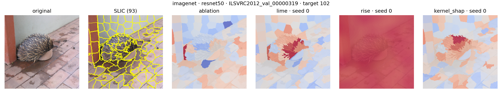
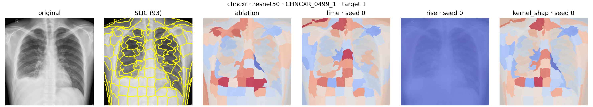

# M3 中期结果报告

## 1. 完成范围

M3 已完成 LIME、RISE、Ablation、KernelSHAP 四种核心方法的默认设置比较，覆盖 ImageNet、CHNCXR 两个数据域和 ResNet-50、VGG13 两种模型。

| 项目 | 设置 |
|---|---|
| 每域固定样本 | 10 张 |
| ImageNet 样本 | 10 个类别各 1 张 |
| CHNCXR 样本 | 阴性 5 张、阳性 5 张 |
| SLIC 名义区域数 | 100 |
| LIME、RISE、KernelSHAP 前向预算 | 1024 |
| RISE 网格 / 保留概率 | 7×7 / 0.50 |
| 随机种子 | 0、1、2、3、4 |
| 输入稳定性 | `ε=0.01`，每次归因 10 个扰动输入 |
| 解释目标 | 正确类别的 Softmax 前 logit |
| 遮蔽基线 | 归一化输入空间中的零 |

每个数据域生成 320 条方法记录：三种随机方法各 100 条，Ablation 20 条；两域合计 640 条。

## 2. 完整性与数值审计

| 审计项 | ImageNet | CHNCXR |
|---|---:|---:|
| 完整方法记录 | 320/320 | 320/320 |
| 基础归因前向样本 | 308,926 | 309,016 |
| 输入稳定性前向样本 | 3,089,260 | 3,090,160 |
| Insertion/Deletion 评价前向样本 | 13,440 | 13,440 |
| Max-Sensitivity 未定义 | 0 | 0 |
| Cosine Similarity 未定义 | 0 | 0 |
| 定位指标记录 | 320 | 160 |
| 轻微扰动后预测类别变化 | 0 | 0 |

KernelSHAP 共运行 200 次，全部设计矩阵满秩；效率约束残差绝对值最大值为 `2.22×10⁻¹⁶`。四种方法的基础归因、稳定性重算和评价前向次数均与模型适配器的实际计数一致。

## 3. ImageNet 默认设置结果

随机方法先在同图内对 5 个种子取均值，再对 10 张图取中位数。

| 模型 | 方法 | Insertion | Deletion | Max-Sens | Cosine | 掩码内能量 | Pointing | 秒/图 | 前向数 |
|---|---|---:|---:|---:|---:|---:|---:|---:|---:|
| ResNet-50 | Ablation | 6.6230 | 4.7076 | 0.5082 | 0.9331 | 0.4717 | 1.0000 | 0.2026 | 86.5 |
| ResNet-50 | LIME | **6.9666** | 2.6768 | 0.1581 | 0.9921 | **0.6260** | 1.0000 | 2.9201 | 1024 |
| ResNet-50 | RISE | 6.3770 | 5.0206 | **0.0129** | **1.0000** | 0.3001 | 0.4000 | 6.3096 | 1024 |
| ResNet-50 | KernelSHAP | 6.6847 | **2.4095** | 0.1171 | 0.9948 | 0.4937 | 1.0000 | 2.7377 | 1024 |
| VGG13 | Ablation | 16.6054 | 3.9575 | 0.1605 | 0.9915 | 0.5974 | 1.0000 | 0.1912 | 86.5 |
| VGG13 | LIME | **19.8692** | **1.5150** | 0.0584 | 0.9989 | 0.6644 | 1.0000 | 2.7020 | 1024 |
| VGG13 | RISE | 11.1139 | 5.3542 | **0.0157** | **1.0000** | 0.3044 | 1.0000 | 5.7891 | 1024 |
| VGG13 | KernelSHAP | 19.1944 | 1.5612 | 0.0722 | 0.9985 | **0.6742** | 1.0000 | 2.6231 | 1024 |

ImageNet 上，LIME 与 KernelSHAP 构成主要忠实性优势组。ResNet-50 中 LIME 的 Insertion 最高，KernelSHAP 的 Deletion 最低；VGG13 中 LIME 的 Insertion 和 Deletion 均领先，KernelSHAP 的掩码内能量最高。RISE 的输入与跨种子稳定性最高，同时归因耗时最长。Ablation 用约 86.5 次前向和约 0.2 秒完成单图归因，形成低成本参照。

## 4. CHNCXR 默认设置结果

定位指标在 5 张具有病灶并集掩码的阳性胸片上计算。

| 模型 | 方法 | Insertion | Deletion | Max-Sens | Cosine | 病灶内能量 | Pointing | 秒/图 | 前向数 |
|---|---|---:|---:|---:|---:|---:|---:|---:|---:|
| ResNet-50 | Ablation | 7.1296 | -5.1846 | 0.0444 | 0.9994 | 0.0094 | 0.0000 | 0.2113 | 91 |
| ResNet-50 | LIME | 8.5807 | **-7.4612** | 0.0205 | 0.9998 | **0.0134** | 0.0000 | 3.0383 | 1024 |
| ResNet-50 | RISE | -0.3991 | 0.3674 | **0.0077** | **1.0000** | 0.0000 | 0.0000 | 6.1491 | 1024 |
| ResNet-50 | KernelSHAP | **8.6634** | -7.2067 | 0.0265 | 0.9998 | 0.0128 | 0.0000 | 2.9172 | 1024 |
| VGG13 | Ablation | 9.5970 | -2.8424 | 0.0140 | 1.0000 | 0.0084 | 0.0000 | 0.1924 | 91 |
| VGG13 | LIME | **16.3443** | **-7.2087** | 0.0115 | 1.0000 | 0.0099 | 0.0000 | 2.6312 | 1024 |
| VGG13 | RISE | 3.7070 | 0.5873 | **0.0041** | **1.0000** | **0.0232** | 0.0000 | 5.5572 | 1024 |
| VGG13 | KernelSHAP | 15.5363 | -6.5146 | 0.0130 | 1.0000 | 0.0119 | 0.0000 | 2.6807 | 1024 |

CHNCXR 上，ResNet-50 的 KernelSHAP Insertion 最高、LIME Deletion 最低；VGG13 的 LIME 在两项忠实性指标上领先。RISE 的输入稳定性和跨种子稳定性最高，忠实性低于 LIME 与 KernelSHAP。四种方法的 Pointing Game 中位数均为 0，病灶内能量显著低于 ImageNet，归因响应主要分布于病灶并集之外。

## 5. 跨种子稳定性

| 数据域 | 模型 | 方法 | Spearman | Top 20% Jaccard |
|---|---|---|---:|---:|
| ImageNet | ResNet-50 | LIME | 0.5634 | 0.4590 |
| ImageNet | ResNet-50 | RISE | **0.9939** | **0.8901** |
| ImageNet | ResNet-50 | KernelSHAP | 0.3356 | 0.3646 |
| ImageNet | VGG13 | LIME | 0.7360 | 0.7589 |
| ImageNet | VGG13 | RISE | **0.9943** | **0.9230** |
| ImageNet | VGG13 | KernelSHAP | 0.7198 | 0.6282 |
| CHNCXR | ResNet-50 | LIME | 0.8907 | 0.6843 |
| CHNCXR | ResNet-50 | RISE | **0.9924** | **0.8873** |
| CHNCXR | ResNet-50 | KernelSHAP | 0.8443 | 0.6213 |
| CHNCXR | VGG13 | LIME | 0.7973 | 0.6366 |
| CHNCXR | VGG13 | RISE | **0.9920** | **0.8911** |
| CHNCXR | VGG13 | KernelSHAP | 0.7497 | 0.6204 |

RISE 在四个数据域—模型组合中均取得最高跨种子稳定性。KernelSHAP 在 ImageNet—ResNet-50 上的种子敏感性最高，M4 的预算扫描将检验增加联盟样本数对其稳定性的改善幅度。

## 6. M3 结论与 M4 输入

1. KernelSHAP 已接入与 LIME、RISE、Ablation 相同的数据、模型、SLIC、logit、遮蔽基线、预算计数和结果格式。
2. Insertion/Deletion、Max-Sensitivity、Cosine Similarity、耗时、前向次数、掩码内能量和 Pointing Game 已覆盖四个数据域—模型组合。
3. LIME 与 KernelSHAP 在两域中形成主要忠实性优势，RISE 形成稳定性优势，Ablation 形成效率优势。
4. CHNCXR 的病灶定位响应显著低于 ImageNet，M4 按医学配置选择集扫描更细 SLIC 粒度和 RISE 网格。
5. CHNCXR 434 张共同正确样本已冻结为 86 张配置选择集和 348 张最终评价集，分层后两集合无重叠。
6. OrdShap 的原算法核验、图像包装、预算估算和位置归因实验统一安排在 M4。

## 7. 结果索引

- [ImageNet 完整报告](../../results/metrics/m3_imagenet_default_20260913/REPORT.md)
- [CHNCXR 完整报告](../../results/metrics/m3_chncxr_default_20260913/REPORT.md)
- [ImageNet 汇总指标](../../results/metrics/m3_imagenet_default_20260913/summary.json)
- [CHNCXR 汇总指标](../../results/metrics/m3_chncxr_default_20260913/summary.json)
- [ImageNet 固定样本清单](../../data/splits/m3_imagenet_default_20260913/imagenet_selection.json)
- [CHNCXR 固定样本清单](../../data/splits/m3_chncxr_default_20260913/chncxr_selection.json)
- [医学配置选择划分](../../data/splits/chncxr_m3_config_selection.json)
- [ImageNet 可视化清单](../../results/figures/m3_imagenet_default_20260913/manifest.json)
- [CHNCXR 可视化清单](../../results/figures/m3_chncxr_default_20260913/manifest.json)

### ImageNet 示例

### CHNCXR 阳性示例

